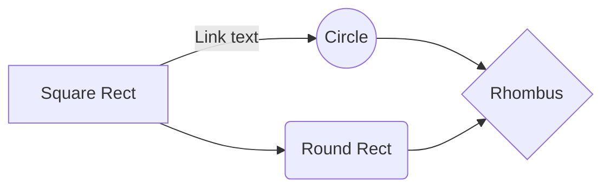

# FreeRtos_blinky
Simple LED light blinking program that uses FreeRtos as a scheduler and runs on an Arduino Uno Rev3

```mermaid
graph LR
A[Square Rect] -- Link text --> B((Circle))
A --> C(Round Rect)
B --> D{Rhombus}
C --> D
```
